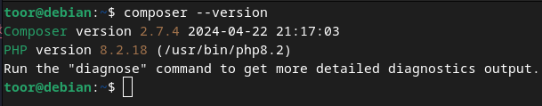

# Requisitos:

:::info NOTA
Los siguentes programas son necesarios para el objetivo de este tutorial, si no tiene alguno de las siguientes aplicaciones, es necesario que sean instaladas antes de continuar.
:::

## 1) PostgreSQL
PostgreSQL es una aplicacion de gestión de base de datos relacional orientada a objetos.

:::info Para poder instalar y configurar Postgres revise el siguiente [enlace](https://howtoforge.es/como-instalar-postgresql-y-la-herramienta-pgadmin-en-debian-12/).
:::

## 2) Postman
Con esta aplicación podremos probar las API web para resolver el problema de compartir pruebas API.
:::info Siga el siguente tutorial para instalar Postman [Aquí](https://gist.github.com/Akhil-Suresh/e036a52bd00104ab21e9891224157809).
:::


## 3) PHP
PHP es un lenguaje de programación interpretado​ del lado del servidor y de uso general que se adapta especialmente al desarrollo web.
:::info Sigue el siguiente [encale](https://www.linuxtechi.com/how-to-install-php-on-debian/) para instalar PHP en tu computador.
:::


## 4) Composer
Esto es un sistema de gestión de paquetes para programar en PHP el cual provee los formatos estándar necesarios para manejar dependencias y librerías de PHP.


Para instalar composer, primero se debe crear una carpeta **"bin"** en la ruta `/root/usr/local` y luego ejecutar los siguientes comandos:

```sh
curl -sS https://getcomposer.org/installer > composer-setup.php
```
```sh
sudo php composer-setup.php --install-dir=/usr/local/bin --filename=composer
```
Y  por último:
```sh
composer --version
```
Si todo está bien, debería retornar un mensaje como este:




## 5) PDO
PDO proporciona una capa de abstracción de acceso a datos, lo que significa que, independientemente de la base de datos que se esté utilizando, se emplean las mismas funciones para realizar consultas y obtener datos.

Para instalar esta extención solo hay que ejecutar el siguiente comando en la terminal y listo.
```sh
sudo apt-get install php-pgsql
```

> **Nota**: Una forma de saber si contamos con el paqute PDO es irse al info.PHP desde el localhost en el navegador y revisar que en la sección "PDO" diga "mysql"